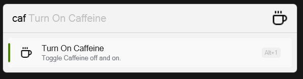

Caffiene for Flow Launcher
==================
A plugin for [Flow launcher](https://github.com/Flow-Launcher/Flow.Launcher) that prevents your pc from sleeping or turning off the monitor.

Icons from [Lucide](https://lucide.dev/).
Thanks for that one guy on stackexchange that had a nice clean example of how power mangement works.

## Installation
1. Extract release, place folder into %appdata%/FlowLauncher/Plugins folder and restart FlowLauncher.

## Usage
    type in caf to toggle on and off.
